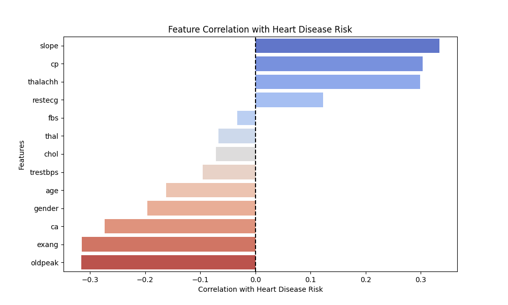

# Heart Disease Prediction
## Getting Started
### Installing
1. Install Python on your computer.
```
https://www.python.org/downloads/
```
2. Create a new environment.
```
conda create -n dev python=3.10 anaconda -y
```
3. Activate the environment.
```
conda activate dev
```
4. Install all the required dependencies.
```
pip install -r requirements.txt
```
5. Clone this repository to your local computer.
```
git clone https://github.com/janakhamis/heart-disease-prediction.git
```

## Usage
1. To run the neural network model, create a new notebook on [Google Colab](https://colab.research.google.com/), then upload the Jupyter Notebook `heart_disease.ipynb` from your local repository.
2. Run each cell sequentially to perform data cleaning, analysis, visualizations, and train the neural network model.
3. Navigate to the repository in Visual Studio Code.
4. Open the terminal and run the `app.py` application.
```
python app.py
```
5. The terminal should generate the server link http://127.0.0.1:5000/ .
6. Press `Ctrl` + Click the link to open the app in your default browser.

##  Project Overview
Heart disease is one of the leading causes of death worldwide, and early detection is crucial for preventative care and treatment. This project aims to build a machine learning-powered web application that predicts a user's heart disease risk based on key health parameters.

The web app leverages a deep learning model (Neural Network) trained on a heart disease dataset, taking user inputs such as age, cholesterol, chest pain type, fasting blood sugar, and more to estimate the probability of heart disease.

##  Objectives
* Develop a **Flask web application** that allows users to input health parameters.
* Use a **trained deep learning model** to predict heart disease risk.
* Display **personalized risk percentage and a visualization**.
* Provide **user-friendly explanations** with tooltips for each input field.

## Cleaning the Data
* Renamed columns: `target` to `risk` and `sex` to `gender`.
* Check to ensure no missing values.
* Converted the cleaned DataFrame into a CSV and downloaded it.

## Data Exploration
Generated the following graphs:
  * A bar chart showing the distribution of ages among participants.
  * A scatter plot to visualize the relationship between age and cholesterol level of participants.
  * A pie chart that shows the ratio of female and male participants in the dataset.
  * A pie chart showing a majority of participants in the dataset have Fasting blood sugar above 120 mg/dl.
  * A bar chart that plots the number of participants against the likelihood of having a heart attack.

## Data Analysis and Visualizations
Answered the following questions:
1. Which features are the most indicative of an individual having heart disease?

2. What is the distribution of heart disease across different age groups?

3. How does oldpeak (ST depression) affect the possibility of a heart attack?

4. Are there threshold values for features like resting heart pressure or cholesterol levels that indicate a higher chance of having heart disease?


## Machine Learning Models
1. Neural Network Model
   * Used `risk` as the target variable and everything else as feature variables.
   * Split the preprocessed data into training and testing, then scaled the data.
   * Defined the deep neural network, specifying the following:
      * Three hidden layers with 120, 60, and 30 neurons, respectively.
      * Used the `ReLU` activation function for all the hidden layers and `sigmoid` for the output layer.
   * Compiled and trained the model.
      * Achieved an accuracy of 100%.
   * Exported and saved our model as a HDF5 file and our scaler as a PKL file.
   * Evaluated our model using test data.
      * Achieved an accuracy of 96.82%.
2. Random Forest Model
   * Created a Random Forest Classifier, fitted the model, and made predictions using testing data.
   * Calculated the confusion matrix, accuracy score, and feature importance.
3. Decision Tree Model
   * Created a Decision Tree Classifier, fitted the model, and made predictions using testing data.
   * Calculated the confusion matrix and accuracy score.
4. KNearestNeighbors
   * Created a KNeighbors Classifier, fitted the model, and made predictions using testing data.
   * Generated the confusion matrix and classification report.

## Models Tested and Performance Comparison
To ensure the best predictive performance, we tested and evaluated **four different machine learning models**:

| Model | Accuracy |
|--------|----------|
| **Neural Network (Deep Learning - Keras/TensorFlow)** | **1.00 (100%)** |
| **Random Forest Classifier** | **0.97 (97%)** |
| **Decision Tree Classifier** | **0.96 (96%)** |
| **K-Nearest Neighbors** | **0.95 (95%)** |

### Why We Chose the Neural Network Model
- The **Neural Network Model** achieved the highest accuracy (**100%**) compared to the other models.
- It demonstrated superior learning capability and **generalization**, reducing misclassification errors.
- The model effectively captured **complex relationships** within the dataset, improving predictive power.

## Dataset and Features
The dataset used in this project contains various health-related parameters that may contribute to **heart disease risk**. Below are the key features:

| Feature | Description |
|---------|------------|
| **Age** | Age of the individual |
| **Gender** | Male (1) or Female (0) |
| **Chest Pain Type (cp)** | Types: Typical Angina, Atypical Angina, Non-Anginal Pain, Asymptomatic |
| **Resting Blood Pressure (trestbps)** | Blood pressure measured in mmHg |
| **Cholesterol (chol)** | Serum cholesterol level (mg/dL) |
| **Fasting Blood Sugar (fbs)** | 1 if fasting blood sugar > 120 mg/dL, otherwise 0 |
| **Resting ECG (restecg)** | Electrocardiographic results |
| **Max Heart Rate Achieved (thalach)** | Maximum recorded heart rate |
| **Exercise-Induced Angina (exang)** | 1 = Yes, 0 = No |
| **Oldpeak (ST Depression) (oldpeak)** | ST segment depression in ECG |
| **Slope of Peak Exercise ST Segment (slope)** | Indicates heart stress test results |
| **Number of Major Vessels Colored by Fluoroscopy (ca)** | Ranges from 0 to 3 |
| **Thalassemia (thal)** | 1 = Normal, 2 = Fixed Defect, 3 = Reversible Defect |
| **Target (risk)** | 1 = High risk of heart disease, 0 = Low risk |

## Building the Web App
**HTML**:
1. Built the structure and layout of the webpage.
2. Imported the Google Fonts library.
3. Created the style of the buttons, the tooltip, and the form where users input the relevant features.

**Results HTML**:
1. Built the structure and layout of the webpage.
2. Imported the necessary library Google Fonts.
3. Created the style of the button and provided the results from the inputs.

**Javascript**:
1. Designed the `Back` buttons to be able to navigate from Page 2 to Page 1 and Page 3 to Page 2.
2. Formatted the `Next` buttons to enable going to the next page only if the user has inputted all the required information.
3. When all input fields have been filled, enable the `Submit` button.
4. Added event listeners to validate the page.

**Flask App**:
1. Imported the necessary dependencies, such as Flask, TensorFlow, Numpy, and Pickle.
2. Loaded the trained model and scaler.
3. Added the following routes:
   * `/`: Homepage
   * `/predict`: Form submission and prediction results

## Datasets
- [heart_disease_dataset.csv](./data/heart_disease_dataset.csv)

## Outputs
- [cleaned_heart_disease.csv](./data/cleaned_heart_disease.csv)
- [graphs/](./graphs/)
- [heart_disease_model.h5](./models/heart_disease_model.h5)
- [scaler.pkl](./models/scaler.pkl)

## Group Members
- Jana Khamis
- Paul Schaefer
- King Yuet Lau (Janette)
- Bhavesh Heetoo

## References
Nazirkhan, Farhaan. “Heart Disease Prediction Dataset.” Kaggle, 27 Sept. 2024, www.kaggle.com/datasets/mfarhaannazirkhan/heart-dataset.
