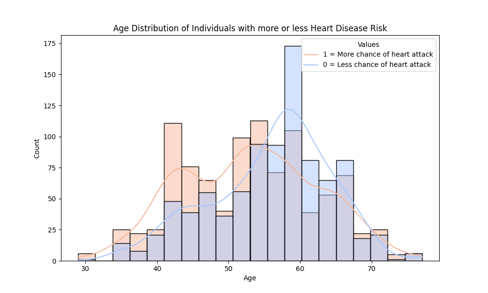

# Heart Disease Prediction
##  Project Overview
Heart disease is one of the leading causes of death worldwide, and early detection is crucial for preventative care and treatment. This project aims to build a machine learning-powered web application that predicts a user's heart disease risk based on key health parameters.

The web app leverages a deep learning model (Neural Network) trained on a heart disease dataset, taking user inputs such as age, cholesterol, chest pain type, fasting blood sugar, and more to estimate the probability of heart disease.

##  Objectives
- Develop a **Flask web application** that allows users to input health parameters.
- Use a **trained deep learning model** to predict heart disease risk.
- Display **personalized risk percentage and a visualization**.
- Provide **user-friendly explanations** with tooltips for each input field.

## Getting Started
1. Install Python on your computer.
```
https://www.python.org/downloads/
```
2. Create a new environment.
```
conda create -n dev python=3.10 anaconda -y
```
3. Activate the environment.
```
conda activate dev
```
4. Install all the required dependencies.
```
pip install -r requirements.txt
```
5. Clone this repository to your local computer using `git clone`.
6. To run the neural network model, create a new notebook on [Google Colab](https://colab.research.google.com/), then upload the Jupyter Notebook `heart_disease.ipynb` from your local repository.
7. Run each cell sequentially to perform data cleaning, analysis, visualizations, and train the neural network model.
8. Open the repository in Visual Studio Code.
9. Open the terminal and run the `app.py` file using the following command:
```
python app.py
```
10. The terminal should generate the server link http://127.0.0.1:5000/ .
11. Press `Ctrl` + Click the link to open the app in your default browser.

## Cleaning the Data:
1. Renamed columns: `target` to `risk` and `sex` to `gender`.
2. Check to ensure no missing values.
3. Converted the cleaned DataFrame into a CSV and downloaded it.

## Data Exploration:
Generated the following graphs:
  * A bar chart showing the distribution of ages among participants.
  * A scatter plot to visualize the relationship between age and cholesterol level of participants.
  * A pie chart that shows the ratio of female and male participants in the dataset.
  * A pie chart showing a majority of participants in the dataset have Fasting blood sugar above 120 mg/dl.
  * A bar chart that plots number of participants against the likelihood of having a heart attack.

## Data Analysis and Visualizations:
Answered the following questions:
1. Which features are the most indicative of an individual having heart disease?

2. What is the distribution of heart disease across different age groups?

3. 
4. 
5. Plotted the number of complaints per month as a line graph with the average and upper control limit (UCL) and saved it as a PNG.

## Building the Complaints Dashboard:
**HTML**:
1. Built the structure and the layout of the dashboard.
2. Imported the necessary libraries, such as Leaflet.js, Plotly.js, Bootstrap, and Google Fonts.
3. Created different sections for the state filter dropdown menu and visualizations.

**Javascript**:
1. Loaded the data from the `sample_complaints.json` using D3.js.
2. Built a function to populate the state name dropdown.
3. Created the choropleth map and bar charts, which would change based on the state selected.
4. Implemented interactive map clicking that filters the dashboard.
 
## Dashboard:
- **State Filter Dropdown Menu**:
  - The default option is set to "All".
  - Users can filter the data by state.

- **Complaints Summary**:
  - Total Complaints: Displays the total number of complaints for all states or the selected state.
  - Timely Response: Shows the total number of complaints that received timely responses for all states or the selected state.

- **US Map**:
  - Visually displays the state selected
  - Users can hover over each state to see the number of complaints and the state abbreviation.
  - Allows users to click on a state to filter the entire dashboard.
  - A colour gradient is shown based on the number of complaints each state receives when all states are selected.

- **Bar Charts**:
  - Complaints by Product: Shows the number of complaints by product for all states or the selected state.
  - Complaints by Issue: Displays the top 10 complaints by issue for all states or the selected state.

## Ethical Considerations:
We ensured the dataset was publicly available and provided by the United States government. Any sensitive information in the dataset is anonymized, and the study does not reinforce regional or demographic biases. Visualizations and insights are given honestly to ensure fairness and openness. Data is presented without bias or manipulation to alter outcomes.

## Datasets:
- complaints.csv
- state_names.csv
- logo.png

## Outputs:
- sample_complaints.csv
- sample_complaints.json
- index.html
- Number of Complaints Per Month.png

## How to Run it 
1. Open the cloned file in the Visual Studio Code:
   1. Go to file > Open Folder and navigate to the folder where you cloned the repository.
   2. Select the folder to open in VS code.
2. Run the Jupyter Notebook:
     1. Open the notebook file (complaints_notebook.ipynb) in VS code or Jupyter.
     2. Run the cells to perform the Analysis.
3. Run the HTML file:
    1. Right-click on the HTML file (index.html) and click "Open with Live Server".
    2. Alternatively, open the HTML file (index.html) and press Alt + L followed by Alt + O.

## Group Members:
- Jana Khamis
- Paul Schaefer
- King Yuet Lau (Janette)

## References:
- “Consumer Complaint Database.” Consumer Financial Protection Bureau, www.consumerfinance.gov/data-research/consumer-complaints/. Accessed 7 Jan. 2025.
- Pettini, Francesco. “US State Names Codes and Abbreviations.” Kaggle, 15 Feb. 2022, www.kaggle.com/datasets/francescopettini/us-state-names-codes-and-abbreviations.
